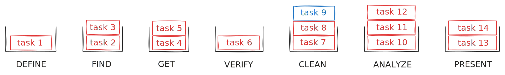
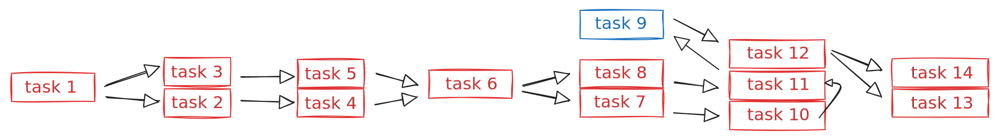

# The Data Pipeline

**A 7-step methodology to structure your data projects.**

*Created by [School of Data](https://web.archive.org/web/20220417194310/https://schoolofdata.org/), refined by CLI.*

---

## Introduction

If you're like us, you may have noticed that many talk about data, but few clearly define it. So let's start with that: **data is a structured representation of the world.** Every dataset involves two commitments — choosing what part of the world to represent, and choosing how to encode that representation. Whether your project is a small internal database or a global data collection effort, everything ends up hinging on two risks: a flawed structure (encoding) or gaps in the data (representation). The data pipeline addresses both, methodically, and for projects of all sizes.

The pipeline has been through several iterations since its creation in 2012, with a major one in 2016, when Cédric added the Define step to it. Ten years later, AI models have emerged, bringing with them an enormous potential for innovation. But they also bring a greater need for transparency, structure, and control. More than ever, the data pipeline is needed.

---

## The 7 Steps

```
DEFINE  →  FIND  →  GET  →  VERIFY  →  CLEAN  →  ANALYZE  →  PRESENT
```

---

### 1. Define

**Narrow a broad theme into specific, testable questions. This gives every subsequent step a clear target.**

Defining a project means moving from a theme to a research question, then from a research question to one or more hypotheses. Good questions are specific enough to hint at the data required and realistic enough given your constraints — time, skills, data availability.

A key skill here is **tabular thinking**: the ability to identify which data points would answer your questions and how they should be structured to enable analysis. This is a core component of data literacy. The **horizon table** puts tabular thinking into practice — you design the columns (variables) you need before searching for data. It prevents focus drift by defining the analytical destination up front.

Looping between Define, Find, and Get is common as the question sharpens.

<details>
<summary><strong>More on this step</strong></summary>

A vague question like "Are children affected by air pollution?" gives no direction. A specific one — "Are air pollution levels around primary schools in Paris higher than the city average?" — hints at the data needed and can be refined into testable hypotheses. From there, designing the horizon table (the columns you'd need to answer the question) anchors every subsequent step.

AI can help brainstorm questions, suggest variables, and critique hypothesis formulations. It should not replace domain knowledge in scoping what is realistic.

**Typical outputs**: Research questions, hypotheses, horizon table design (column headers).

</details>

---

### 2. Find

**Locate where the data lives and assess whether you can get it. This scopes the effort before you commit to a retrieval strategy.**

Data can live in several places — open portals, non-public systems, physical archives, behind APIs, freely on the web — or it may not exist at all, requiring you to construct it from scratch. Each location implies a different retrieval method and level of effort.

When the ideal dataset doesn't exist, proxy indicators — related data that approximates what you need — reward creativity. This step can make or break a project, so don't give up too early.

<details>
<summary><strong>More on this step</strong></summary>

The range goes from a straightforward download on an open data portal, to a Freedom of Information request for data held by a public administration, to the realization that the data doesn't exist and must be constructed through field collection or crowdsourcing. Each scenario implies a fundamentally different level of effort, and recognizing this early prevents committing to a project that can't be completed.

AI can help identify potential sources, suggest search strategies, and draft FOI requests. It cannot assess whether a source is trustworthy or complete.

**Typical outputs**: List of sources, links to scrape, draft access requests.

</details>

---

### 3. Get

**Extract the data from its source into a usable format on your machine. Depending on the data's existence and accessibility, this can be a simple download or a project in itself.**

What you do depends on the format and accessibility. A CSV on an open data portal is a download. A table locked in a PDF requires extraction. Data on a web page requires scraping. Data that doesn't exist yet requires field collection — surveys, manual transcription, crowdsourcing — which may demand skills and timelines far beyond the rest of the project.

A **format/retrieval matrix** maps each source format to the appropriate extraction method and is the core reference for this step. Native data files (CSV, JSON, XLS) need no transformation. Digital PDFs require extraction tools. Scanned documents require OCR. Web pages require scraping. And data that doesn't exist yet requires a full collection process.

<details>
<summary><strong>More on this step</strong></summary>

The complexity ranges from a one-click download to designing and executing a field survey with collection instruments, respondent management, and data aggregation. Retrieval difficulty is rarely obvious from the outside — a seemingly simple PDF may have tables that resist extraction, and an API may have rate limits or authentication requirements that complicate what looked straightforward.

AI can help build extraction tools (scraping scripts, API queries, formula suggestions) and design collection strategies. AI-assisted extraction — especially from PDFs — requires systematic verification of results.

**Typical outputs**: Folder of raw data files (archived; all subsequent work is done on copies).

</details>

---

### 4. Verify

**Check whether the data you got is the data you need. Verification often extends beyond what people immediately think about.**

Data quality can be mapped on two axes: **structuration** (how well the data is encoded) and **representativity** (how well it captures reality). This produces four quadrants: good data, poorly encoded data, hallucinations (fabricated or impossible values), and falsified or erroneous data.

Verification checks three pillars: **trustworthiness** (does the data represent reality?), **completeness** (does it cover the full picture?), and **quality** (is it well-structured and documented?). Four methods apply: ask the source, consult domain experts, run statistical checks, and apply common sense. Producing a **data dictionary** (describing the meaning of columns and values) and documenting **metadata** (provenance, methodology, collection dates) helps structure what you actually have on hand.

Beyond obvious checks, verification involves understanding the data production process, assessing granularity, evaluating source trustworthiness, and testing compatibility with other key datasets. It is often skipped due to perceived lack of time — particularly after a long collection process — but this is where errors compound.

<details>
<summary><strong>More on this step</strong></summary>

Common issues include: missing values disguised as zeros or fallback dates (1900, 1904, 1969, 1970), duplicated rows, inconsistent date formats, unspecified units, ambiguous column names, undocumented provenance, and spreadsheets truncated at old software limits (65,536 rows in Excel, 255 columns in Numbers). Statistical summaries (mean, median, max, min, standard deviation) on key columns are a first line of defense.

AI can help write scripts that produce statistical summaries and flag anomalies. Anomaly detection should be documented via deterministic methods. AI cannot assess source trustworthiness, data production methodology, or compatibility with other datasets.

**Typical outputs**: Verification log, data dictionary, metadata documentation.

</details>

---

### 5. Clean

**Prepare the data for analysis. This step produces the horizon table, which is why some cleaning is always involved.**

Cleaning divides into three operations. **Tidying** fixes structure without changing content — removing formatting artifacts, splitting merged cells, aligning misaligned columns. **Editing** corrects or enriches content — handling missing values, removing duplicates, adding calculated or categorization columns. **Consolidation** merges separate datasets via a common key, adding context or precision.

At the end of this step, the data should match the horizon table designed during Define — the columns you identified as necessary are now populated and queryable.

Back up before each operation. Use one tab per cleaning step. Never overwrite the original. Looping between Verify and Clean is normal — verification reveals problems that cleaning fixes, and cleaning can surface new issues to verify.

<details>
<summary><strong>More on this step</strong></summary>

Tidying makes each column contain one variable and each row one observation. Editing ensures the values are correct and complete. Consolidation adds columns that require data from a second source. The three operations, applied in sequence, transform raw data into the populated horizon table — the analytical destination designed during Define.

AI can help write cleaning scripts and formulas. Pattern-based transformations should be documented as scripts, not performed ad hoc. Every output requires manual verification.

**Typical outputs**: The populated horizon table (cleaned, merged, ready for analysis).

</details>

---

### 6. Analyze

**Test hypotheses against the cleaned data. This is where you produce the insights that answer your original questions.**

Three types of analysis exist: **descriptive** (means, medians, distributions), **inferential** (correlations, sampling-based conclusions), and **predictive** (modeling, machine learning). Most projects stay descriptive.

The analysis methodology follows a chain: a theme decomposes into hypotheses, which become analysis questions, which get reformulated using actual column names from the cleaned dataset. Writing this chain down produces a reproducible analysis plan — anyone with the cleaned data and the plan should reach the same results.

<details>
<summary><strong>More on this step</strong></summary>

The key discipline is reformulating hypotheses at the level of actual columns. "Urban areas have more digital inclusion spaces" becomes "count values in the `name` column grouped by `zone_code`, compare against `population_density`." This reformulation is the analysis plan — a chain from abstract question to concrete data operation that anyone can reproduce.

AI can help write analysis code and suggest statistical approaches. Pattern detection should run through documented scripts. AI cannot replace the analyst's judgment on what the results mean.

**Typical outputs**: Analysis log documenting each step, the query used, and the finding.

</details>

---

### 7. Present

**Communicate findings to your audience, in visual or other form. The presentation should serve the story, not just the data.**

Data is not always the centerpiece of a story. It may be just one input among interviews, documents, and field observation. This is why the step is called "Present," not "Visualize." In an investigation with eight articles, only three might include data visualizations — the rest draw on the data without displaying it directly.

Three emphases guide presentation choices: **data** (precise exploration, interactivity), **design** (visual impact, memorability), **message** (narrative-first, infographics). The audience determines which emphasis to lead with. Choosing a chart type starts with the visualization task — comparison, proportion, distribution, hierarchy, flow, change over time — not with the tool.

<details>
<summary><strong>More on this step</strong></summary>

All three emphases apply to every presentation; the choice is which to lead with. A specialist audience may call for a data-first interactive visualization. A general audience may call for a design-led piece that makes the finding memorable. A narrative-driven project may call for infographics or scrollytelling where the data supports the story rather than driving it.

AI can help draft narratives, suggest visualization types for a given task, and generate chart code. It cannot make editorial judgment calls about what to emphasize or omit.

**Typical outputs**: Published outputs (articles, visualizations, dashboards) and documentation of the compromises made — what was left out, what was simplified, and why.

</details>

---

## Execution: From Steps to Tasks

The seven steps define what a data project involves. Execution happens at a different level: **tasks**.

A task is a discrete unit of work that belongs to exactly one step and produces a concrete deliverable. "Download the education budget dataset from data.gouv.fr" is a Get task. "Compute the average cost per student by region" is an Analyze task. A task should not cross step boundaries — if it does, it is probably two tasks.

Each step contains one or more tasks. A short project — a quick news brief on a municipal budget vote — may have one task per step. A complex investigation — an international inquiry into tax evasion — may have dozens, with several tasks running within the same step before the project moves on.



### Tasks don't flow in a straight line

The seven steps are presented in sequence, but in practice, tasks form a dependency graph. Some tasks run in sequence within a step. Others fork into parallel tracks — two datasets being cleaned independently before being consolidated. Others converge — multiple verification findings feeding into a single cleaning operation. And tasks frequently loop back to earlier steps: a Find task reveals that the original question was too broad, so a new Define task narrows it; an Analyze task surfaces a data quality issue, sending the project back to Verify and Clean.



This back-and-forth is how the pipeline is designed to work, not a sign of failure. Every practitioner loops between Define, Find, and Get as the question sharpens. The Verify–Clean cycle is almost always iterative. Returning to an earlier step with new information is a feature of the methodology.

### Scaling

The same seven steps apply whether the project has 5 tasks or 50. What changes is the number of tasks per step, the depth of each task, and the complexity of the dependency graph between them. A project with a single, clean dataset from an open data portal will move through Get, Verify, and Clean quickly. A project that requires merging five datasets from different sources — some scraped, some extracted from PDFs, some collected in the field — will spend most of its time in those same three steps, with many tasks running in parallel and feeding into each other.

The pipeline is a framework for thinking about what needs to happen. The tasks are where the actual work gets done.
